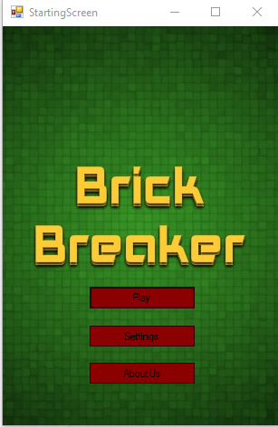
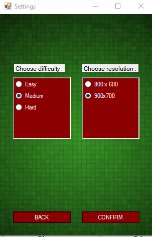
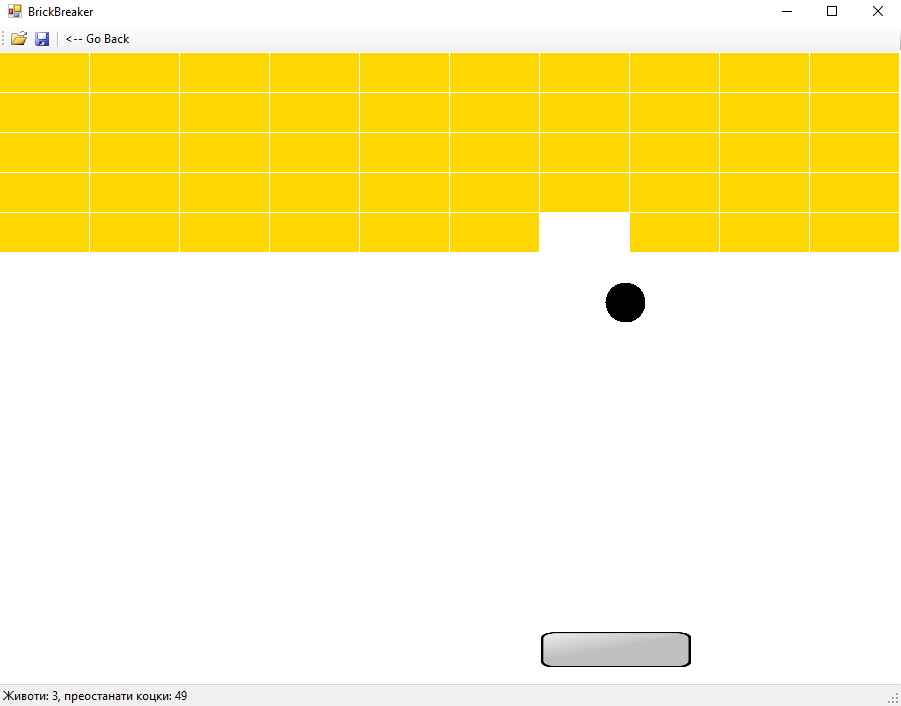

# **Brick Breaker**

Windows Forms Project by: **Simon Stojanovski, Gabriel Buragev, David Stojanovski**

#### 1. Опис на апликацијата  
-Нашата апликација која ја развивавме се темели на основа на веќе постоечка игра која го носи истото име. Ние успеавме да ја рекреираме играта, но без бонуси при удар на брик.  
Линк до играта [BrickBreaker](https://playzool.com/games/brickBreakerTUC/brickBreakerTUC/?o=portrait)

Напомена: Во играта секоја функција, класа, објект е направен од страна на лицата кои се пријавени на проектов, само сликите се превземени од интерент.

#### 2. Упатство за користење на играта

-За да се започне нова игра се притиска на копчето **Play**, потоа се појавува нов прозорец каде што се избираат нивоата, при клик на некое од нивоата се отвара прозорецот за играње.
На прозорецот каде што се одбираат нивоата има копче **Load Game**, кое може да се искористи за играчот да продолжи со својата игра доколку претходно ја има зачувано.

На почетниот прозорец исто така има и копче **Settings** кое при клик отвара нов прозорец во кој може да играчот да одбере едно од 3те тежини:  
-Easy  
-Medium  
-Hard  
или пак да ја смени резолуцијата на играта, понудени се 2 опции и тоа:
- 800 x 600
- 900 x 700

Откако ќе се изберат тежината и резолуцијата се притиска на **Confirm** доколку сакаме да го промениме, во спротивно се клика на копчето **Back**

#### 2.1 Правила на играта

-Секој играч има 3 живота. Животот го губи доколку не успее да го удри топчето, односно му падне под слајдерот.  
-При губење на живот, доколку играчот сеуште ги нема изгубено сите топчето се позиционира над слајдерот и при клик на екранот пролжува да се движи.   
-Доколку се изгубат сите животи нивото се ресетира.  
-Бриковите се во 3 бои. Жолтата има 1 живот, сивиот 2 живота и синиот 3.  
-Нивото се смета за поминато доколку се исчистат сите брикови. Долу на статус барот пишува уште колку му имаат останато на играчот, но исто така ги пишува преостанатите животи.  
-Слајдерот може да се движи само лево десно и тоа со помош на глушецот.  

#### 3 Структури, класи

-Во оваа апликација топчето, слајдерот и бриковите се посебни класи. Исто така има класа и за нивоата, тие се генерираат со помош на функција која ја имаме имплементирано и истите се зачувуваат во Json file. Во нашата апликација имаме искористено променливи од типот **String, int, double, boolean**, имаме искористено **List** за бриковите, **Dictionary** за бриковите и сл.  
Сите класи се сериализирани.

#### 3.1 Опис на класата Brick
-Во оваа класа чуваме боја на брикот, висина, ширина, животи и точки ху. Имаме еден конструктор кој прима Point xy, int ширина и Level.BrickType бриктип кој е енум се чува во класата Level.
Висината на секој брик е статична и изнесува 40px. Во конструкторот се сетираат точките, ширината и според енум се додава боја на брикот, и животи. Во оваа класа имаме метод bool isCrushed() кој проверува дали брикот има животи и истиот намалува животи повикува друг метод changeColor() и ако брикот има 0 живот враќа труе, односно ќе врати false.
Имаме исто така и метод void changeColor() кој ја менува бојата на брикот. Во истава класа постои и метод void Draw кој го исцртува брикот.

#### 4 Screenshot od GameScreen

